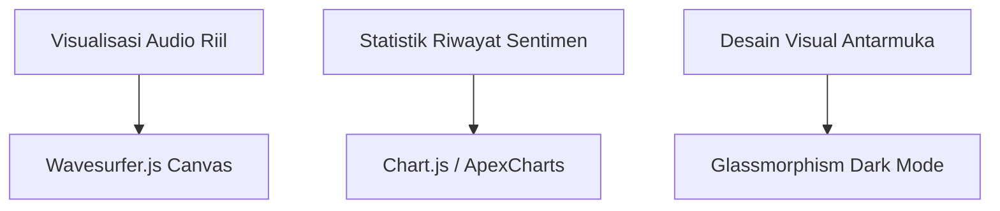

# BLUEPRINT SISTEM: VOICE-TO-VOICE SENTIMEN ANALYSIS SYSTEM (INDONESIA)

Dokumen ini berisi cetak biru (blueprint) lengkap mengenai arsitektur, teknologi, struktur folder, rincian per file, petunjuk instalasi, serta rekomendasi pengembangan lebih lanjut untuk sistem analisis sentimen suara berbahasa Indonesia ini.

---

## 1. PENJELASAN SISTEM & KEGUNAAN

### Deskripsi Sistem
Sistem ini merupakan aplikasi berbasis web interaktif untuk **Voice-to-Voice Sentiment Analysis (Analisis Sentimen Suara-ke-Suara)** dalam Bahasa Indonesia. Sistem bekerja dengan cara menangkap suara pengguna secara langsung melalui mikrofon, melakukan pengenalan suara (STT), membersihkan teks hasil transkripsi (Preprocessing), mengklasifikasikan sentimen teks tersebut (Machine Learning & Rule-based), dan memberikan respon balik berupa audio suara (TTS) yang mengumumkan hasil sentimen.

### Flow Kerja Sistem (Pipeline)
```
[Input Suara Pengguna (Mikrofon)]
              │
              ▼
[Web Audio API (Client)] ───► Deteksi Hening (Silence Detection)
              │
              ▼ (Kirim file .webm)
[Flask Server (app.py)]
              │
              ├─► 1. Konversi Format: FFmpeg (.webm -> .wav)
              ├─► 2. Speech-to-Text: Google Speech Recognition API (id-ID)
              ├─► 3. Text Preprocessing: Normalization -> Slang Normalization -> Context Spelling Correction
              ├─► 4. Sentiment Classifier: Rule-Based Guard (Umpatan & Formal) -> SVM Machine Learning
              └─► 5. Text-to-Speech: gTTS (Google Text-to-Speech)
              │
              ▼ (Kirim file .mp3)
[Audio Respon Balik (Client)] ───► Memutarkan Suara Hasil & Pertanyaan Lanjutan
```

### Kegunaan Praktis
1. **Analisis Layanan Pelanggan (Customer Service Sentiment)**: Dapat digunakan oleh call center untuk mendeteksi emosi atau sentimen pelanggan secara real-time dari suara mereka.
2. **Asisten Virtual Suara (Voice Assistant)**: Memungkinkan asisten pintar (seperti "Neo") mengenali suasana hati pengguna dari perkataannya sehingga dapat merespon dengan nada yang sesuai.
3. **Alat Bantu Pembelajaran & Psikologi**: Membantu menganalisis keadaan emosional atau respon verbal seseorang dalam skenario wawancara atau konseling secara interaktif.

---

## 2. ARSITEKTUR & TEKNOLOGI YANG DIGUNAKAN

Sistem ini dirancang menggunakan arsitektur **Hybrid Client-Server** dengan pembagian beban kerja sebagai berikut:

| Komponen | Teknologi | Deskripsi / Fungsi |
| :--- | :--- | :--- |
| **Backend Framework** | `Flask (Python)` | Menyediakan REST API, menangani routing halaman, serta mengelola backend pipeline (STT, Preprocessing, Klasifikasi, TTS). |
| **Speech-to-Text (STT)** | `SpeechRecognition (Google API)` | Mengubah sinyal audio suara menjadi transkripsi teks dalam Bahasa Indonesia (`id-ID`). |
| **Text-to-Speech (TTS)** | `gTTS (Google Text-to-Speech)` | Mengubah teks hasil analisis sentimen kembali menjadi audio suara yang alami. |
| **Audio Transcoder** | `FFmpeg` | Digunakan untuk mengkonversi rekaman audio dari format web browser (`.webm`) menjadi format PCM WAV (`.wav`) berfrekuensi 16kHz mono agar dapat diproses oleh pustaka SpeechRecognition. |
| **Sentiment Classifier** | `Scikit-Learn (SVM)` & `Joblib` | Model klasifikasi Support Vector Machine (SVM) yang dilatih menggunakan ~15.000 data latih berbahasa Indonesia, dikombinasikan dengan pembobotan fitur TF-IDF. |
| **Rule-Based Engine** | `Custom Python Regex & Lexicon` | Menangani pengecualian kata umpatan, filter formal sentence, serta penyelarasan makna harfiah nama hewan (contoh: kata "anjing" dalam konteks hewan vs. makian). |
| **Spelling Correction** | `Levenshtein & Bigram LM` | Mengoreksi kata-kata typo hasil transkripsi suara dengan membandingkan edit-distance (Levenshtein) dan probabilitas kata berikutnya (Bigram Language Model). |
| **Frontend UI/UX** | `HTML5, CSS3 (Vanilla), JavaScript` | Antarmuka interaktif dengan animasi gelombang visual (*pulsating blobs*) dan deteksi keheningan audio otomatis menggunakan Web Audio API. |

---

## 3. STRUKTUR FOLDER & RINCIAN DETAIL PER FILE

Berikut adalah pohon direktori dari project dan rincian kegunaan dari setiap file:

```text
FLASK2/
├── app.py                     # Controller & Server Utama Flask
├── requirements.txt           # Daftar Dependensi Pustaka Python
├── run.bat                    # Script Batch Windows untuk Setup & Run Otomatis
├── README.txt                 # Dokumentasi Singkat & Informasi Pengembang
│
├── ffmpeg/                    # Executable FFmpeg untuk Windows
│   └── bin/
│       └── ffmpeg.exe         # File binary transcoder audio
│
├── model/                     # Modul AI & Dataset Pendukung
│   ├── model3/
│   │   ├── svm_model3.pkl       # Model Support Vector Machine yang sudah terlatih
│   │   ├── tfidf_vectorizer3.pkl# Vectorizer TF-IDF untuk ekstraksi fitur teks
│   │   └── label_encoder.pkl    # Encoder label kelas sentimen (Positif, Negatif, Netral)
│   ├── corpus.txt             # Data korpus kalimat untuk melatih Bigram LM
│   ├── corpus2.txt            # Daftar kata baku Bahasa Indonesia untuk pembanding typo
│   ├── data_training.csv      # Dataset tambahan untuk validasi akurasi saat startup
│   └── rulebased.py           # Logika guard sentimen formal dan deteksi umpatan
│
├── preprocessing/             # Pipeline Pembersihan Teks
│   ├── normalization.py       # Case folding, slang normalization, filter filler words
│   ├── context_spelling.py    # Algoritma koreksi typo berbasis konteks bigram
│   ├── spelling_candidate.py  # Pembangkit kandidat typo berbasis jarak Levenshtein
│   ├── ngram_model.py         # Implementasi Bigram Language Model dengan Laplace smoothing
│   └── lexicon.py             # Kumpulan kata makian, pronomina, dan intensifier
│
├── templates/                 # Halaman Tampilan HTML (Jinja2 Templates)
│   ├── index.html             # Halaman Awal / Welcome Screen
│   └── main.html              # Halaman Dashboard Utama Voice Recognition
│
└── static/                    # Aset Statis Client-Side
    ├── css/
    │   └── style.css          # Desain Styling, Animasi Blob Pulsating, & Layouting
    ├── js/
    │   └── record.js          # Logika Rekaman, Silence Detection, Wake Word, & state flow
    └── tts/                   # Folder penyimpanan sementara hasil generate suara (.mp3)
```

### Rincian Detail Fungsi Setiap File:

1. **`app.py`**
   Merupakan inti dari server Flask. Bertugas untuk:
   * Membuka server lokal dan memuat file model AI (SVM, TF-IDF Vectorizer, Label Encoder) serta corpus kata baku.
   * Melatih Bigram Language Model secara langsung saat startup menggunakan data di `data_training.csv` dan `corpus.txt`.
   * Endpoint `/analyze`: Menerima file audio rekaman utama, mengonversinya menggunakan FFmpeg, mengirimkannya ke Google STT, menjalankan pembersihan teks (Normalization & Spell Correction), menentukan sentimen lewat pengecekan aturan berjenjang (Rule-based -> SVM), kemudian mengubah hasil analisis menjadi respon audio baru via gTTS.
   * Endpoint `/analyze_answer`: Menangkap respon konfirmasi pengguna setelah analisis ("ya" untuk lanjut bicara, atau "tidak" untuk mengakhiri program).
   * Endpoint `/wake_word`: Menunggu kata kunci aktivasi ("Halo Neo", "Halo Neu", "Halo Meo") ketika sistem dalam kondisi standby.

2. **`preprocessing/normalization.py`**
   Berfungsi membersihkan teks transkripsi dari anomali suara. Tahapannya:
   * *Case Folding*: Mengubah teks menjadi huruf kecil semua.
   * *Remove Noise*: Mengabaikan karakter selain alfanumerik namun tetap melindungi format angka bernilai desimal/ribuan.
   * *Normalize Slang*: Mengubah kata tidak baku menjadi kata baku berdasarkan kamus slang (contoh: "ga" atau "nggak" menjadi "tidak").
   * *Remove Repeated Characters*: Memperbaiki kata-kata yang diucapkan terlalu panjang (contoh: "jelekkk" menjadi "jelek").
   * *Remove Filler*: Membuang kata jeda lisan (filler words) seperti "eee", "umm", "sih", "deh".

3. **`preprocessing/context_spelling.py`**
   Mengoreksi kesalahan ejaan transkripsi suara (typo) secara cerdas dengan menganalisis kata sebelum dan sesudahnya (*context-aware*). Mengabaikan kata pendek, kata yang sudah pasti ada di kosakata baku (`corpus2.txt`), dan kata-kata umum (*common words*). Jika ada typo, sistem membandingkan nilai probabilitas kata yang paling pas berdasarkan Bigram Language Model.

4. **`preprocessing/spelling_candidate.py`**
   Mengimplementasikan algoritma **Levenshtein Distance** untuk mengukur jarak perbedaan karakter antara kata yang typo dengan kosakata yang tersedia di kosa kata latih. Menghasilkan daftar kandidat kata yang memiliki jarak edit maksimal sebesar 2 karakter.

5. **`preprocessing/ngram_model.py`**
   Menyediakan kelas `BigramLM` untuk membuat model bahasa n-gram (berbasis 2 kata berurutan) dengan tambahan metode Laplace Smoothing guna mencegah probabilitas bernilai nol pada kata yang belum pernah dilihat sebelumnya.

6. **`preprocessing/lexicon.py`**
   Menyimpan database statis berupa list kata makian kasar (`KATA_MAKIAN`), kata ganti orang (`PRONOMINA`), dan kata penekanan makna (`INTENSIFIER`). Digunakan oleh modul rule-based untuk mendeteksi intensitas kalimat kasar.

7. **`model/rulebased.py`**
   Berperan sebagai *guard* sentimen sebelum masuk ke model SVM. Isinya meliputi:
   * `FORMAL_POSITIVE` & `FORMAL_NEGATIVE`: Kumpulan kalimat formal terstruktur beserta fungsi pengecekannya.
   * `detect_umpatan`: Logika pendeteksi kata kasar yang cerdas. Kata makian seperti "anjing" akan dideteksi sebagai sentimen negatif jika diikuti oleh pronomina/intensifier (misal: "anjing kamu", "anjing banget").
   * `is_literal_animal_context`: Mencegah kesalahan klasifikasi jika kata "anjing" memang merujuk kepada konteks nama hewan asli (misalnya ada kata "hewan", "peliharaan", "setia", "lucu" dalam satu kalimat). Sentimen akan diarahkan menjadi positif/netral dan memotong jalur klasifikasi SVM.

8. **`static/js/record.js`**
   Mengatur jalannya alur interaktif pada antarmuka web:
   * Mengatur state transisi sistem: Standby Wake Word $\rightarrow$ Mendengarkan Rekaman $\rightarrow$ Menampilkan Hasil & Suara TTS $\rightarrow$ Menanyakan Kelanjutan $\rightarrow$ Restart / Standby Kembali.
   * **Silence Detection (Web Audio API)**: Mengukur level amplitudo suara dari mikrofon secara berkala. Jika pengguna berhenti berbicara selama lebih dari 3 detik (`SILENCE_LIMIT`), perekaman akan dihentikan secara otomatis dan audio dikirim ke server.
   * **Wake Word Standby**: Melakukan perekaman audio mini (durasi 3 detik) terus menerus secara berkala ketika server dalam kondisi mati/standby, lalu mencocokkannya ke server untuk mendeteksi kata "Halo Neo".

---

## 4. CARA MENJALANKAN SISTEM (RUNNING INSTRUCTIONS)

Sistem ini sangat mudah dijalankan di lingkungan Windows berkat adanya file pembungkus otomatis `run.bat`.

### Langkah-Langkah Menjalankan:

1. **Persiapan Perangkat**:
   * Pastikan mikrofon (*Microphone*) dan pengeras suara (*Speaker*) Anda terpasang dengan baik dan aktif.
   * Pastikan Anda terhubung ke internet (karena STT Google & gTTS memerlukan akses API daring).

2. **Jalankan File Batch**:
   * Klik ganda pada file **`run.bat`** yang berada di folder utama.
   * Program secara otomatis akan melakukan:
     1. Memeriksa keberadaan Python (disarankan versi 3.12.x).
     2. Membuat *virtual environment* (`venv`) secara otomatis jika belum ada.
     3. Mengaktifkan `venv` tersebut.
     4. Menginstal seluruh pustaka yang tertulis di `requirements.txt` jika baru pertama kali dijalankan (ditandai dengan munculnya file penanda `.requirements_installed`).
     5. Menjalankan server Flask (`python app.py`).
     6. Membuka peramban web browser default Anda secara otomatis ke alamat **`http://127.0.0.1:5000`**.

3. **Cara Penggunaan di Browser**:
   * Di halaman awal, klik tombol **"Mulai"**.
   * Halaman dashboard akan terbuka dan terdengar suara sambutan dari TTS: *"Halo, saya adalah sistem voice recognition untuk analisis sentimen!"*
   * Setelah itu, ucapkan kalimat yang ingin Anda analisis. Sistem akan mendeteksi ketika Anda selesai berbicara (hening > 3 detik) dan memprosesnya.
   * Hasil transkripsi, normalisasi, dan sentimen akan langsung ditampilkan di layar serta dibacakan kembali oleh suara asisten.
   * Asisten akan bertanya: *"Apakah ada lagi yang ingin Anda bicarakan?"*
     * Jawab dengan suara **"Ya"**, **"Iya"**, atau **"Lanjut"** untuk berbicara lagi.
     * Jawab dengan suara **"Tidak"**, **"Enggak"**, atau **"Stop"** untuk menutup sesi. Sistem akan mengucapkan kata penutup *"Terima kasih, sampai jumpa!"* dan kembali masuk ke mode standby.
     * Ucapkan **"Halo Neo"** untuk mengaktifkan kembali sistem dari jarak jauh.

---

## 5. REKOMENDASI PENGEMBANGAN MASA DEPAN (FUTURE ENHANCEMENTS)

Berdasarkan analisis arsitektur saat ini, berikut adalah blueprint pengembangan tingkat lanjut untuk meningkatkan performa, skalabilitas, dan keindahan sistem:

### A. Konversi ke Sistem Offline Penuh (Local STT & TTS)
* **Kelemahan Saat Ini**: Bergantung penuh pada Google API. Jika koneksi internet terputus, sistem akan gagal total.
* **Solusi**:
  * **STT Offline**: Integrasikan pustaka **Whisper** (via `faster-whisper` atau `whisper.cpp`) atau **Vosk SDK** khusus Bahasa Indonesia. Model ini dapat berjalan secara lokal di CPU/GPU komputer lokal tanpa memerlukan internet.
  * **TTS Offline**: Menggunakan **Piper TTS** (menghasilkan suara berkualitas tinggi yang sangat alami secara lokal) atau **pyttsx3** sebagai opsi cadangan paling ringan.

### B. Pembaruan UI/UX Premium (Modern Glassmorphic Dashboard & Real-Time Waveform)
* **Kelemahan Saat Ini**: Desain antarmuka tergolong sederhana (hanya 3 buah blob CSS).
* **Solusi**:
  * Ubah tampilan menjadi *Glassmorphism Dashboard* dengan warna dasar gelap (*dark mode*) berkilau modern.
  * **Visualisasi Audio Real-time**: Menggunakan pustaka **Wavesurfer.js** atau canvas HTML5 untuk menggambar gelombang frekuensi audio riil secara bergelombang dinamis sewaktu pengguna berbicara, menggantikan blob CSS statis.
  * Tambahkan panel riwayat klasifikasi sentimen di sebelah kanan layar lengkap dengan visualisasi diagram batang/lingkaran menggunakan **Chart.js** untuk menunjukkan tren sentimen.



### C. Klasifikasi Berbasis Deep Learning & Model Multimodal (Emotion & Text Sentiment)
* **Kelemahan Saat Ini**: Model SVM berbasis TF-IDF kurang mampu menangkap konteks kalimat panjang yang rumit. Selain itu, emosi dinilai hanya berdasarkan kata-kata tertulis, bukan nada suara (sarcasm tidak akan terdeteksi jika hanya menganalisis teks).
* **Solusi**:
  * **Text Classifier**: Upgrade ke model NLP Transformer seperti **IndoBERT** atau **IndoRoBERTa** menggunakan library `transformers` dari HuggingFace untuk akurasi klasifikasi semantik yang jauh lebih matang.
  * **Multimodal Classifier**: Buat model ekstraktor fitur suara menggunakan **Librosa** (untuk mengekstrak *Mel-Frequency Cepstral Coefficients* / MFCC, pitch, dan tempo) lalu gabungkan dengan hasil klasifikasi teks. Ini memungkinkan sistem mendeteksi kemarahan, kesedihan, atau kebahagiaan murni berdasarkan **nada getaran suara** pengguna meskipun kata-katanya netral.

### D. Integrasi Database & Sistem Manajemen Riwayat (History & Export Report)
* **Kelemahan Saat Ini**: Semua hasil analisis langsung hilang begitu halaman web dimuat ulang (refreshed).
* **Solusi**:
  * Hubungkan aplikasi Flask dengan database relasional ringan seperti **SQLite** atau database NoSQL seperti **MongoDB**.
  * Simpan riwayat transkripsi teks, durasi pemrosesan, file rekaman suara `.wav` pengguna, dan hasil klasifikasinya.
  * Sediakan fitur ekspor laporan berkala ke format **PDF** atau **Excel (XLSX)** untuk keperluan pelaporan analitis bisnis.

### E. Integrasi Large Language Model (LLM) untuk Asisten Interaktif
* **Kelemahan Saat Ini**: Respon balik sistem sangat statis dan kaku (hanya mengulangi *"Hasil analisis sentimen Anda adalah..."*).
* **Solusi**:
  * Integrasikan API **Gemini** atau LLM lokal (**Ollama** dengan model Llama-3-8B-Instruct).
  * Sistem tidak hanya menganalisis sentimen, melainkan berperan sebagai asisten cerdas yang menanggapi curahan hati pengguna secara bijak dengan nada bicara yang menyesuaikan emosi terdeteksi (misalnya menghibur jika pengguna bersedih).
